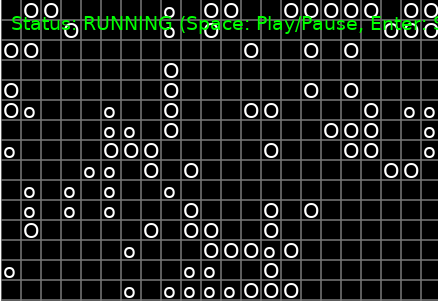

# See-Crits

This game is made to help a friend learn Python and is based on the common school project critters.

It's a bit slapped together, but you can copy or write a single class file and change how it works then the game will launch with your new critter.

The game will automatically detect all critter files in the folder.

Can you beat all the other critters?

It's MIT so that it will be easy to share your critters, modify the game and challenge your friends.

# Rules

Rules are simple. Your critter is given information about the spaces directly in front, left, right, and behind. From this you can tell if there's nothing, a wall, a friendly critter, or an enemy.

Your job is to make a critter that can decide when to spend a move turning, and when to walk forwards. If there's an enemy in from of you when you walk forwards, you will change that critter into a new critter of your type.

That's pretty much it!

Simple rules can make complex play.

The engine needs some work. It's not made to be efficient.

I'll probably update and add some optional features soon.

Please share your critters or anything you do with the project. Thanks

# Installation

git clone https://github.com/DanielTheSilly/See-Crits.git

on Windows:
python -m venv venv
venv\Scripts\activate

on Mac/Linux
python3 -m venv venv
venv\bin\activate

on both:
pip install -r requierments.txt

# Running

(from folder)
python SeeCrits.py
